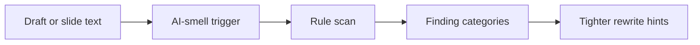

# AI Detect Skill

Portable audit skill for spotting template-heavy or AI-smelling wording in drafts, slides, reports, homework, and sendable writing.

## Who This Is For

| Use this when you... | Use something else when you... |
| --- | --- |
| need to audit a deliverable for AI-smelling wording | want to determine whether a person or model authored a text |
| want reusable rules for placeholder titles, process filler, and over-explaining | need to rewrite an entire paper from scratch |
| need a bounded audit rather than a full rewrite | want to classify private chat logs unrelated to final deliverables |

## Why This Exists

- Treats AI-smell as a writing-quality signal, not authorship detection.
- Keeps repeatable wording rules in scripts, references, and public data.
- Supports focused edits without flattening the writer's voice.

## What Ships

| Component | Role |
| --- | --- |
| [`ai-detect`](./ai-detect) | installable Codex App skill package |
| [`ai-detect/agents/openai.yaml`](./ai-detect/agents/openai.yaml) | Codex App interface metadata |
| [`ai-detect/references`](./ai-detect/references) | bundled public reference material |
| [`ai-detect/scripts`](./ai-detect/scripts) | bundled helper scripts |
| [`ai-detect/data`](./ai-detect/data) | bundled public data used by the skill |
| [`ai-detect/test-prompts.json`](./ai-detect/test-prompts.json) | trigger and non-trigger examples |
| [`ai-detect/redundancy`](./ai-detect/redundancy) | nested redundancy audit skill |
| [`CHANGELOG.md`](./CHANGELOG.md) | release history |
| [`LICENSE`](./LICENSE) | license |

## Install / Use

### Codex App

- Install the skill from this repo path: `ai-detect`
- GitHub install target:
  - repo: `Mingdao007/ai-detect-skill`
  - path: `ai-detect`
- Restart `Codex App` after installation so the new skill is discovered.

## Workflow

## Coverage

- confirmed-rule scanning for wording that reads too template-driven
- queue-aware extraction and review workflow for borderline phrasing
- draft auditing for slide decks, reports, homework, and markdown writing

## Expected Result / Verification

| Check | Expected result |
| --- | --- |
| Install target | `ai-detect` |
| GitHub target | `Mingdao007/ai-detect-skill` with path `ai-detect` |
| Skill entrypoint | `ai-detect/SKILL.md` exists |
| Trigger examples | `ai-detect/test-prompts.json` |
| Privacy check | public package contains no private local paths or live user state |

## Trigger Examples

- `Check whether this draft sounds AI-written.`
- `Audit these slide titles for template smell.`
- `Scan this report for wording that feels too process-heavy.`

## Non-Trigger Examples

- `Decide whether a person or model wrote this message.`
- `Rewrite the whole paper from scratch.`
- `Classify a private chat log unrelated to final deliverables.`

## Privacy Boundary

This public repository keeps the workflow generic and reusable.

- Private review queues and local session exports are excluded from the public package.
- The published rules stay generic and do not expose personal memory files or local paths.

## Repository Layout

| Path | Purpose |
| --- | --- |
| [`ai-detect`](./ai-detect) | installable Codex App skill package |
| [`ai-detect/agents/openai.yaml`](./ai-detect/agents/openai.yaml) | Codex App interface metadata |
| [`ai-detect/references`](./ai-detect/references) | bundled public reference material |
| [`ai-detect/scripts`](./ai-detect/scripts) | bundled helper scripts |
| [`ai-detect/data`](./ai-detect/data) | bundled public data used by the skill |
| [`ai-detect/test-prompts.json`](./ai-detect/test-prompts.json) | trigger and non-trigger examples |
| [`ai-detect/redundancy`](./ai-detect/redundancy) | nested redundancy audit skill |
| [`CHANGELOG.md`](./CHANGELOG.md) | release history |
| [`LICENSE`](./LICENSE) | license |

Chinese:

- [README.zh-CN.md](./README.zh-CN.md)
