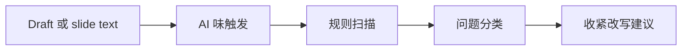

# AI Detect Skill

可移植的写作审计 skill，用于检查 draft、slide、report、homework 和外发文字中的 AI 味、模板感和低信息表达。

## 适合谁

| 适合使用 | 不适合使用 |
| --- | --- |
| 需要检查 deliverable 是否有 AI 味 | 想判断文本到底是不是 AI 写的 |
| 需要复用 placeholder title、process filler、over-explaining 等规则 | 需要从零重写整篇论文 |
| 只需要边界清楚的 audit，而不是全文重写 | 想分析和最终 deliverable 无关的私人聊天记录 |

## 为什么需要它

- 把 AI 味视作 writing-quality signal，而不是 authorship detection。
- 把可复用的措辞规则放在 scripts、references 和 public data 中。
- 支持聚焦修改，而不是抹平作者声音。

## 包含内容

| Component | 作用 |
| --- | --- |
| [`ai-detect`](./ai-detect) | 可安装的 Codex App skill package |
| [`ai-detect/agents/openai.yaml`](./ai-detect/agents/openai.yaml) | Codex App 界面 metadata |
| [`ai-detect/references`](./ai-detect/references) | 随包发布的公开 reference material |
| [`ai-detect/scripts`](./ai-detect/scripts) | 随包发布的 helper scripts |
| [`ai-detect/data`](./ai-detect/data) | skill 使用的公开 data |
| [`ai-detect/test-prompts.json`](./ai-detect/test-prompts.json) | trigger / non-trigger 示例 |
| [`ai-detect/redundancy`](./ai-detect/redundancy) | 嵌套 redundancy audit skill |
| [`CHANGELOG.md`](./CHANGELOG.md) | release history |
| [`LICENSE`](./LICENSE) | license |

## 安装 / 使用

### Codex App

- 从本 repo 的这个路径安装 skill：`ai-detect`
- GitHub install target:
  - repo: `Mingdao007/ai-detect-skill`
  - path: `ai-detect`
- 安装后重启 `Codex App`，让新 skill 被重新发现。

## 工作流

## 覆盖范围

- 基于 confirmed rules 扫描模板化表达
- 对边界表达做 queue-aware extraction 和 review
- 审计 slide deck、report、homework 和 Markdown writing

## 预期结果 / 验证

| 检查项 | 预期结果 |
| --- | --- |
| 安装路径 | `ai-detect` |
| GitHub target | `Mingdao007/ai-detect-skill`，path 为 `ai-detect` |
| Skill 入口 | 存在 `ai-detect/SKILL.md` |
| 触发样例 | `ai-detect/test-prompts.json` |
| 隐私检查 | 公开包不包含私人本机路径或 live user state |

## 触发示例

- `Check whether this draft sounds AI-written.`
- `Audit these slide titles for template smell.`
- `Scan this report for wording that feels too process-heavy.`

## 不应触发

- `Decide whether a person or model wrote this message.`
- `Rewrite the whole paper from scratch.`
- `Classify a private chat log unrelated to final deliverables.`

## 隐私边界

这个公开仓库只保留通用、可复用的 workflow。

- private review queue 和本地 session export 不进入公开包。
- 公开规则保持通用，不暴露 personal memory 文件或本机路径。

## 仓库结构

| 路径 | 作用 |
| --- | --- |
| [`ai-detect`](./ai-detect) | 可安装的 Codex App skill package |
| [`ai-detect/agents/openai.yaml`](./ai-detect/agents/openai.yaml) | Codex App 界面 metadata |
| [`ai-detect/references`](./ai-detect/references) | 随包发布的公开 reference material |
| [`ai-detect/scripts`](./ai-detect/scripts) | 随包发布的 helper scripts |
| [`ai-detect/data`](./ai-detect/data) | skill 使用的公开 data |
| [`ai-detect/test-prompts.json`](./ai-detect/test-prompts.json) | trigger / non-trigger 示例 |
| [`ai-detect/redundancy`](./ai-detect/redundancy) | 嵌套 redundancy audit skill |
| [`CHANGELOG.md`](./CHANGELOG.md) | release history |
| [`LICENSE`](./LICENSE) | license |

English:

- [README.md](./README.md)
